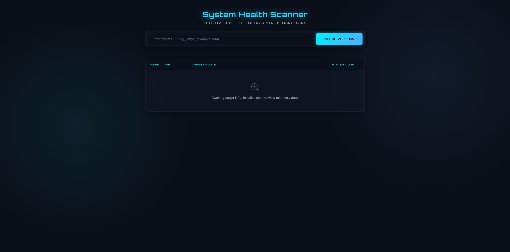
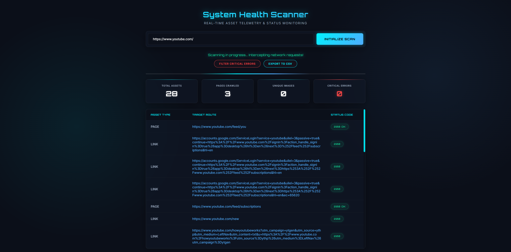
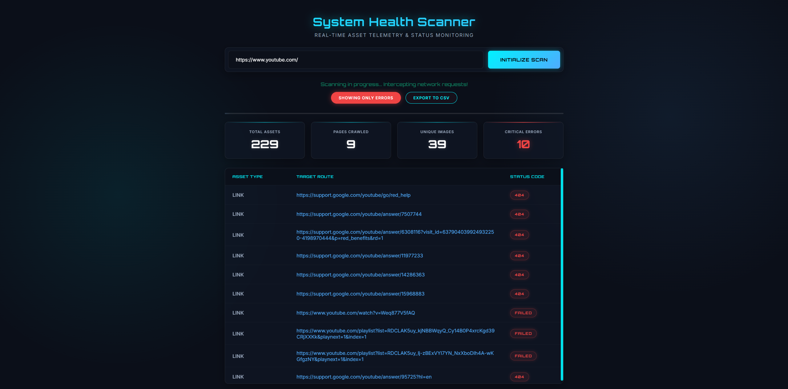

# 🚀 Live Website Health Checker


> *A real-time, asynchronous website crawler and asset telemetry monitor built with Python, Flask, and WebSockets.*

The **Live Website Health Checker** is a high-performance tool designed to crawl webpages, extract internal links and images, and validate their HTTP status codes in real-time. Featuring a sleek, dark-mode glassmorphism UI, it streams results live to the browser as the backend server processes them concurrently.

---

## ✨ Features

* **⚡ Real-Time Telemetry:** Uses WebSockets (`Flask-SocketIO`) to stream asset data directly to the frontend the moment it is discovered and verified.
* **🕵️‍♂️ Bot-Protection Bypass:** Masquerades as a standard Google Chrome browser to bypass strict Web Application Firewalls (Cloudflare, Sucuri) and handles restrictive `HEAD`/`GET` request fallbacks to prevent false `403` or `400` errors.
* **🚀 Concurrent Processing:** Utilizes Python's `ThreadPoolExecutor` to rapidly validate dozens of assets simultaneously without freezing the main crawler.
* **🎨 Futuristic UI:** A responsive, dark-theme "glassmorphism" interface with neon accents, custom scrollbars, and active radar progress animations.
* **📊 Data Export & Filtering:** Instantly filter out healthy links to isolate `404`, `403`, or `500` errors, and export the exact report to a `.csv` file directly from the browser.

---

## 📸 Screenshots

### Active Scanning Interface

*Real-time data streaming with animated DOM interception and live status badges.*

### Critical Error Filtering

*Isolate broken links and export directly to CSV for quick debugging.*

---

## 🛠️ Tech Stack

**Backend:**
* [Python 3.8+](https://www.python.org/)
* [Flask](https://flask.palletsprojects.com/) & [Flask-SocketIO](https://flask-socketio.readthedocs.io/)
* [Selenium WebDriver](https://www.selenium.dev/) (Headless Chrome for JS rendering & lazy-load scrolling)
* [Requests](https://requests.readthedocs.io/) (For rapid HTTP status validation)

**Frontend:**
* HTML5 / CSS3 (Custom Glassmorphism Design)
* Vanilla JavaScript
* [Socket.io Client](https://socket.io/)

---

## ⚙️ Installation & Setup

### 1. Clone the repository
```bash
git clone [https://github.com/yourusername/live-website-checker.git](https://github.com/yourusername/live-website-checker.git)
cd live-website-checker
python main.py